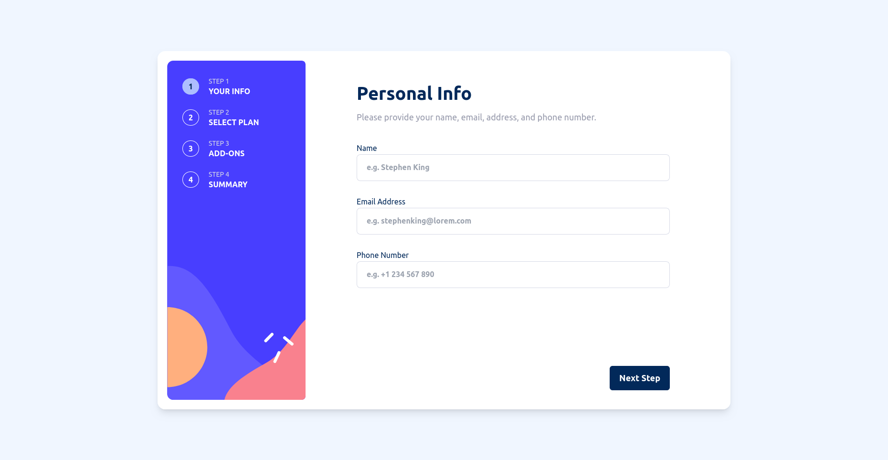

# Frontend Mentor - Multi-step form solution

This is a solution to the [Multi-step form challenge on Frontend Mentor](https://www.frontendmentor.io/challenges/multistep-form-YVAnSdqQBJ). Frontend Mentor challenges help you improve your coding skills by building realistic projects.

## Table of contents

- [Overview](#overview)
  - [The challenge](#the-challenge)
  - [Screenshot](#screenshot)
  - [Links](#links)
- [My process](#my-process)
  - [Built with](#built-with)
- [Author](#author)

## Overview

### The challenge

Your users should be able to:

- Complete each step of the sequence
- Go back to a previous step to update their selections
- See a summary of their selections on the final step and confirm their order
- View the optimal layout for the interface depending on their device's screen size
- See hover and focus states for all interactive elements on the page
- Receive form validation messages if:
  - A field has been missed
  - The email address is not formatted correctly
  - A step is submitted, but no selection has been made

### Screenshot

### Links

- Solution URL: [Github Repository](https://github.com/kbrownw/multiStepForm)
- Live Site URL: [Multistep Form by Keith](https://multistep-form-by-keith.web.app/)

## My process

### Built with

- Semantic HTML5 markup
- CSS custom properties
- Flexbox
- CSS Grid
- Mobile-first workflow
- [React](https://reactjs.org/) - JS library
- [Vite](https://vitejs.dev/) - Devolopement Environment
- [Typescript](https://www.typescriptlang.org/) - Javascript with syntax for types.
- [TailwindCSS](https://tailwindcss.com/) - For styles
- [FramerMotion](https://www.framer.com/motion/) - For animation
- [Awesome-Phonenumber](https://www.npmjs.com/package/awesome-phonenumber) - For phone number validation
- [React-Hook-Form](https://react-hook-form.com/) - Form management and validation
- [IP-Geolocation-API](http://ip-api.com) - IP geolocation information

## Author

- LinkedIn - [Keith Brown](https://www.linkedin.com/in/keith-brown-b9a3a32a2/)
- Frontend Mentor - [@kbrownw](https://www.frontendmentor.io/profile/kbrownw)
- Github - [https://github.com/kbrownw](https://github.com/kbrownw)

**Note: Delete this note and add/remove/edit lines above based on what links you'd like to share.**
